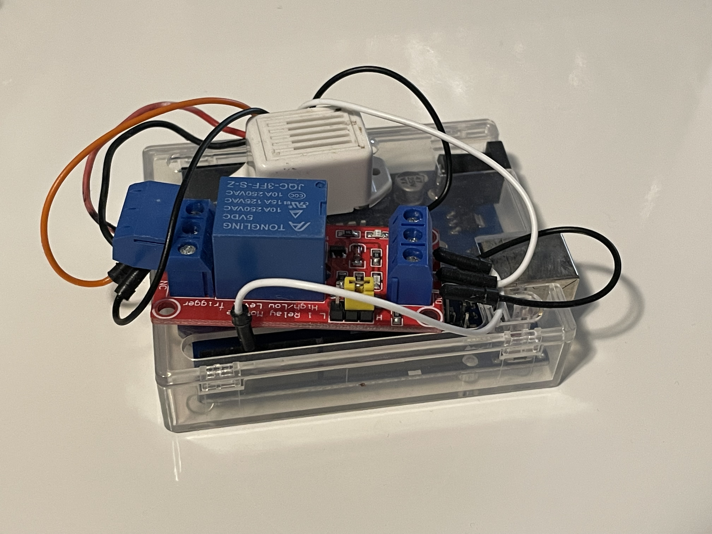

# Best Buy Restock Siren

Are you sick and tired of manually checking restocks for high demand items like GPUs on Best Buy? Well I have just the solution for you! This restock detector consists of a Python program which constantly refreshes a Best Buy product page, until it detects that the item can be added to your cart. It then sends a signal over serial to an Arduino Uno, which can be connected to a siren or other annoying device to get your attention.

## Instructions
1. Download code
2. Flash Arduino code onto Arduino Uno
3. Connect a buzzer to pin 3 of the Arduino (I connected pin 3 to the control signal of a relay, which then switched the buzzer on and off from USB power in order to not exceed the current rating of the Arduino pins)
4. Install the selenium and serial Python libraries
5. Download Selenium Webdriver for your browser and version and put it in the same folder as bot.py
6. Fill out info.py with the Arduino COM port and item URL
7. Run bot.py and enjoy your new GPU! 
